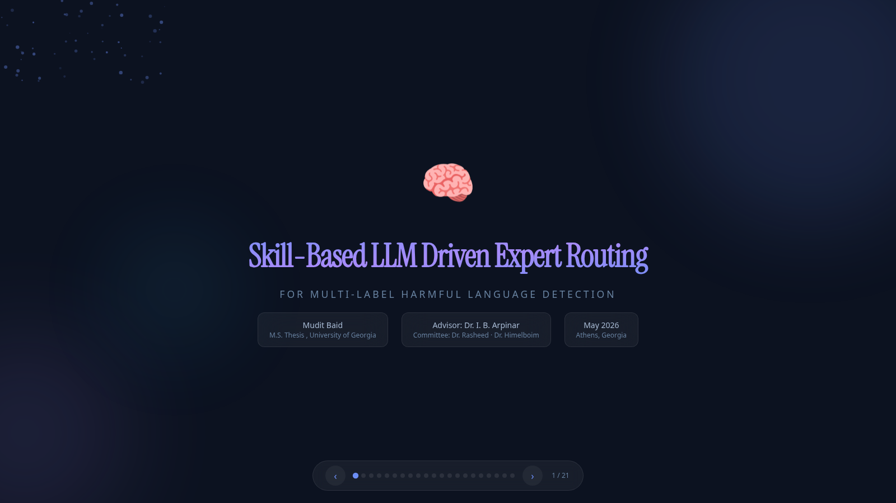

# Skill-Based LLM Driven Expert Routing System For Multilabel Harmful Speech Detection

Product-facing branch for a multilabel harmful-speech detection system that combines symbolic skill inference, a Bernoulli Naive Bayes expert router, LoRA expert adapters, and a web-serving layer.

[Web UI](https://sberhsd.muditb0712.workers.dev)  
[Project Page](https://muditbaid.github.io/Skill-Based-Expert-Routing-System-For-Multilabel-Hate-Speech-Detection/)  
[Production deployment guide](docs/PRODUCTION_DEPLOYMENT.md)

## Project Preview

The repository-hosted presentation page is previewed below. Click the image to open the full page.

<p>
  <a href="https://muditbaid.github.io/Skill-Based-Expert-Routing-System-For-Multilabel-Hate-Speech-Detection/">
    
  </a>
</p>

See the complete deck here: [Open the full project page](https://muditbaid.github.io/Skill-Based-Expert-Routing-System-For-Multilabel-Hate-Speech-Detection/)

## Overview

This repository packages the deployment-ready slice of the project:

- a symbolic skill extractor built on Llama 3.1
- a Bernoulli NB router that selects the top-2 experts from inferred skills
- four task specialists for hate, offense, bullying, and threat detection
- a shared-runtime adapter-switching backend that loads the base model once
- a FastAPI service that exposes the pipeline behind a web UI

The branch is intentionally trimmed to the core runtime, artifacts, and web app assets needed to demonstrate and serve the system.

## Project Page

This branch is GitHub Pages-ready.

- Source file: `docs/index.html`
- Preview image: `docs/assets/project-preview-slide-1.png`
- Expected Pages URL: `https://muditbaid.github.io/Skill-Based-Expert-Routing-System-For-Multilabel-Hate-Speech-Detection/`

To enable it on GitHub:

1. Open repository settings.
2. Go to `Pages`.
3. Set the source to `Deploy from a branch`.
4. Select `main` and folder `/docs`.

After that, the project presentation page will render as a live site directly from the repository.

## System Architecture

### 1. Skill inference

The pipeline first predicts ontology-level skills from raw text using `symbolic-moe/skill_inference.py`. Each post is sampled multiple times, parsed into a controlled vocabulary from `symbolic-moe/skills.txt`, and consolidated through vote thresholds.

### 2. Expert routing

The predicted skills are passed to the Bernoulli Naive Bayes router in `symbolic-moe/route_and_predict_nb.py`. The router is trained from `symbolic-moe/profile_pool_skills.jsonl` and selects the top-2 experts for each example.

### 3. Expert execution

Each selected expert is a LoRA adapter mounted on a shared Llama 3.1 base model. `symbolic-moe/model_utils.py` keeps the base model resident and switches adapters instead of reloading a full checkpoint per task.

### 4. Final aggregation

`symbolic-moe/predict_post.py` runs the full single-post flow:

1. infer skills
2. route top-2 experts
3. execute only the selected adapters
4. keep label matches for the target task
5. return multilabel output with confidences

### 5. Serving layer

`web app/backend/` wraps the pipeline in FastAPI and exposes:

- `POST /api/detect`
- `GET /health/live`
- `GET /health/ready`

The backend can run locally in-process or behind a Colab/remote GPU workflow.

## LangSmith Observability

LangSmith is used for pipeline observability and evaluation workflows rather than the live request path.

Current integrations:

- `symbolic-moe/skill_inference.py` can trace skill-prediction runs
- `symbolic-moe/route_and_predict_nb.py` can trace router scoring, selected experts, expert inference, and evaluation outcomes
- `symbolic-moe/evaluate_outputs.py` can log evaluation traces
- `symbolic-moe/langsmith_workflows.py` supports:
  - dataset upload
  - trace backfill from routed outputs
  - review queue creation
  - hard-case summarization

This makes it possible to inspect difficult examples, compare routing behavior across evaluation splits, and curate annotation/review queues for failure analysis.

Environment flags:

```bash
export LANGSMITH_API_KEY=...
export LANGSMITH_TRACING=true
export LANGSMITH_PROJECT=symbolic-moe
```

See `symbolic-moe/commands.md` for concrete tracing and review commands.

## Repository Layout

```text
.
├── docs/
│   ├── assets/
│   │   ├── project-preview-slide-1.png
│   │   └── project-preview-slide-2.png
│   └── index.html
├── README.md
├── requirements.txt
├── saves/
│   └── llama31-8b/
├── symbolic-moe/
│   ├── build_profiles.py
│   ├── config.py
│   ├── evaluate_outputs.py
│   ├── io_utils.py
│   ├── langsmith_utils.py
│   ├── langsmith_workflows.py
│   ├── model_utils.py
│   ├── predict_post.py
│   ├── route_and_predict_nb.py
│   ├── skill_inference.py
│   ├── skill_parsing.py
│   ├── profile_pool.jsonl
│   ├── profile_pool_skills.jsonl
│   ├── validation_pool.jsonl
│   ├── validation_pool_skills.jsonl
│   ├── test_pool.jsonl
│   ├── test_pool_skills.jsonl
│   ├── profiles.json
│   └── skills.txt
└── web app/
    ├── backend/
    ├── COLAB_BACKEND.md
    └── SERML_Backend.ipynb
```

## Core Artifacts

The branch keeps the main runtime artifacts required by the deployed system:

- `symbolic-moe/skills.txt`: skill vocabulary used by the router
- `symbolic-moe/profile_pool.jsonl`: profile-construction pool
- `symbolic-moe/profile_pool_skills.jsonl`: skill-annotated router training pool
- `symbolic-moe/validation_pool.jsonl`: validation pool
- `symbolic-moe/test_pool.jsonl`: test pool
- `symbolic-moe/profiles.json`: learned expert profiles
- `saves/llama31-8b/*/qlora`: saved expert adapters

## Quick Start

### Install

```bash
pip install -r requirements.txt
```

### Run the backend

```bash
cd "web app/backend"
cp .env.example .env
uvicorn app.main:app --host 0.0.0.0 --port 8000
```

### Local API example

```bash
curl -X POST "http://127.0.0.1:8000/api/detect" \
  -H "Content-Type: application/json" \
  -d '{"text":"I will find you and hurt you."}'
```

## Rebuilding the Pipeline

If profiles or pool artifacts need to be regenerated, the intended order is:

1. run `symbolic-moe/skill_inference.py` on the desired pool
2. rebuild profiles with `symbolic-moe/build_profiles.py`
3. evaluate routing with `symbolic-moe/route_and_predict_nb.py`
4. score outputs using `symbolic-moe/evaluate_outputs.py`

For single-post inference and deployment, `symbolic-moe/predict_post.py` is the canonical entrypoint used by the backend adapter.

## Web App

The Cloudflare convenience URL redirects to the IAP-protected application:

[Web UI](https://sberhsd.muditb0712.workers.dev)

The repository-hosted presentation page is available here once GitHub Pages is enabled:

[Project Page](https://muditbaid.github.io/Skill-Based-Expert-Routing-System-For-Multilabel-Hate-Speech-Detection/)

For Colab-based backend serving, see:

- `web app/COLAB_BACKEND.md`
- `web app/SERML_Backend.ipynb`

## License

This repository inherits the upstream project license in `LICENSE`.

## Production Deployment

The current end-to-end guide is in
[docs/PRODUCTION_DEPLOYMENT.md](docs/PRODUCTION_DEPLOYMENT.md).

Important production defaults:

- Run `gcloud builds submit` from the repository root, where
  `cloudbuild.yaml` is located.
- Cloud Build stages the private GCS model artifacts before building; the
  running container does not download them with `gcloud`.
- The base model is baked into the image, keeping scale-from-zero startup inside
  Cloud Run's startup-probe deadline.
- The image pins a CUDA 12.4-compatible PyTorch/Triton stack and installs the
  Python development headers required for Triton JIT compilation.
- Cloud Run uses one non-zonally-redundant L4 GPU, 8 vCPU, 32 GiB memory,
  concurrency 1, and a maximum of one instance.
- `/health/live` reports process health. `/health/ready` stays at HTTP 503 until
  the base model and all four adapters are loaded and their CUDA/Triton warmup
  succeeds. Production also fails readiness when CUDA is unavailable.
- Cloud Run probes `/health/ready`, so an unhealthy revision is never promoted
  to production traffic.
- Cloud Run's direct IAP integration protects the `run.app` URL without a load
  balancer. It serves the frontend and API from the same origin, avoiding
  third-party IAP cookies; the Cloudflare URL redirects to that origin.

The GitHub Actions workflow authenticates through branch-restricted Workload
Identity Federation, builds and deploys the same-origin application, verifies
model warmup, and deploys the Cloudflare redirect through Wrangler.
